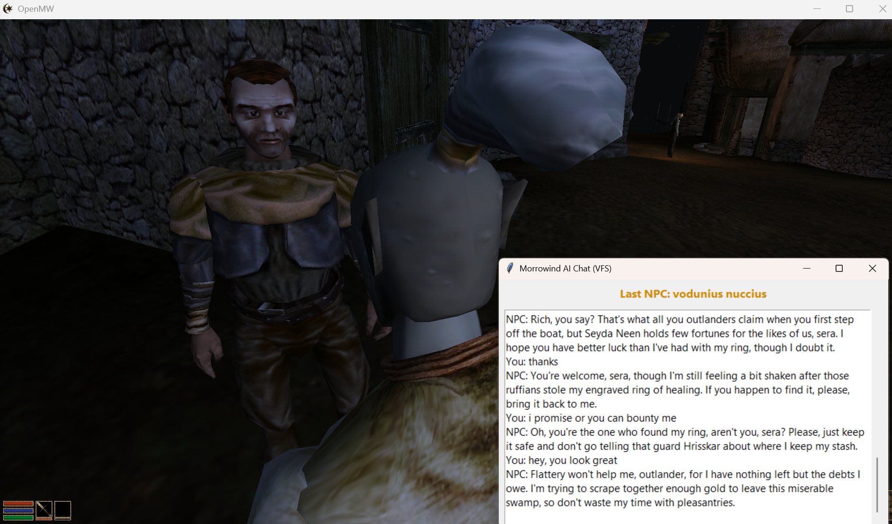

# morrowind-ai

> **⚠️ Work in progress.** Core dialogue works. Radiant ambient D2D and NPC actions are newly added and not yet field-tested in-game. Expect rough edges.

LLM-driven NPC dialogue for **OpenMW 0.49** — persistent per-NPC memory, live conversation, radiant ambient NPC-to-NPC chatter, runs alongside the unmodified game on Windows or Linux.



## What it does

- Press **H** near any NPC to lock onto them — they greet you automatically (no typed input needed).
- Type a message → the NPC replies in-game using Gemini / OpenAI / Claude / Ollama, coloured by emotion.
- NPCs can respond with actions: follow you, flee, turn hostile, or open trade.
- Nearby NPC pairs hold ambient conversations without player involvement (radiant D2D system).
- Every exchange is stored in a per-NPC ChromaDB vector collection, so NPCs remember you across sessions.
- Per-NPC **opinion vector** + **mood residue** + 3 auto-generated **life facts** colour every reply — a guard you angered last week is colder today, an innkeeper you charmed recalls it in her tone. Decays toward neutral over real-time hours. (Gated by `features.disposition`.)

## Why this exists (the novel part)

OpenMW 0.49's Lua sandbox on Windows blocks `io` and writable `os` in global scripts, which kills every "write a file from Lua" IPC pattern. This project uses a **dual-channel bridge** that stays inside the sandbox:

- **Lua → Python**: `print('[MWAI_REQ] <json>')` — Python tails `openmw.log`.
- **Python → Lua**: Python atomically writes `ai_inbox/response.txt` inside a `data=` path; Lua reads it via `openmw.vfs.open()`.

Dedup uses monotonic `req_id` on both sides. No `io`, no external injectors, no modified engine.

Combined with per-NPC ChromaDB memory and a provider-agnostic agent layer, this is (to our knowledge) the first openly published OpenMW LLM dialogue mod that works under the Windows sandbox.

## Architecture

```
+------------------+  print('[MWAI_REQ] ...')   +-------------------------+
| OpenMW Lua       | -------------------------> tail | openmw_log_bridge   |
|                  |                             | (Python, asyncio)       |
| dialogue_ui.lua  |  vfs 'ai_inbox/response'   |  + lore_agent           |
| ipc_client.lua   | <-------------------------- |  + d2d_agent (radiant)  |
| npc_detector.lua |                             |  + NPCMemory (Chroma)   |
| world_events.lua |  vfs 'ai_inbox/npc_speech'  |                         |
|                  | <-- (NPC-to-NPC D2D lines)- +-------------------------+
+------------------+                                        |
                                                    provider (Gemini /
                                                     OpenAI / Claude /
                                                     Ollama / llama.cpp)
```

**Dialogue flow:**
1. Player presses **H** → `dialogue_ui.lua` sends `MorrowindAiDialogueRequest` event
2. `ipc_client.lua` (global) prints `[MWAI_REQ] {type:"dialogue",...}` to openmw.log
3. Python bridge tails the log, dispatches to `lore_agent`, writes `ai_inbox/response.txt`
4. `ipc_client.lua` polls VFS response file, relays reply to player script via event

**Radiant D2D (ambient chatter):**
1. `npc_detector.lua` scans active actors each second; when two named NPCs are ≤300 units apart (60s cooldown), prints `[MWAI_REQ] {type:"npc_npc",...}`
2. Python `d2d_agent` generates a 2–4 line exchange grounded in race/faction personality
3. Python writes exchanges to `ai_inbox/npc_speech.txt`
4. `ipc_client.lua` polls the file and drains lines to the HUD one at a time (3.5s gap)

Linux users can also use the simpler `bridge.py` path (direct file IPC), since Linux OpenMW exposes `io` in global scripts.

## Layout

| Path | Purpose |
|---|---|
| `openmw-mod/` | Lua scripts — dialogue UI, IPC, NPC detector, world events |
| `openmw-mod/scripts/npc_detector.lua` | Radiant NPC pair scanner |
| `python/openmw_log_bridge.py` | Windows sandbox bridge (vfs + print-IPC) |
| `python/bridge.py` | Linux direct file-IPC bridge |
| `python/agents/lore_agent.py` | Player↔NPC dialogue (emotion + action tags) |
| `python/agents/d2d_agent.py` | Ambient NPC-to-NPC radiant dialogue |
| `python/memory/chroma_memory.py` | Per-NPC ChromaDB memory |
| `python/providers/` | Gemini / OpenAI / Anthropic / Ollama / llama.cpp |
| `python/config.yaml` | Per-agent provider + model, campaign_id, radiant config |

## Install

1. Copy `openmw-mod/` to a path on disk (e.g. `C:\morrowind-ai-mod` or `~/morrowind-ai-mod`).
2. In `openmw.cfg` add:
   ```
   data="C:\morrowind-ai-mod"
   content=morrowind-ai.omwscripts
   ```
3. Put your API key in `~/.nemoclaw_env` (or export `GOOGLE_API_KEY` / `OPENAI_API_KEY` / `ANTHROPIC_API_KEY`).
4. `cd python && pip install -r requirements.txt`
5. Run the bridge:
   - **Windows/WSL path**: `python3 python/openmw_log_bridge.py` + `python chat_window_vfs.py` (Windows).
   - **Linux path**: `python3 python/main.py`.
6. Launch OpenMW. In-game, press **H** near an NPC to lock.

## YouTube live-chat integration (optional, disabled by default)

The bridge can listen to a YouTube live stream's chat (via `pytchat`, no API key) and route viewer commands into the game as IPC events (e.g. summon an NPC, trigger weather, spawn a creature).

To enable:

1. `pip install pytchat`
2. Edit `python/config.yaml`:
   ```yaml
   stream:
     enabled: true
     youtube_video_id: "YOUR_LIVE_VIDEO_ID"
   ```
3. Restart `openmw_log_bridge.py`. Chat messages are logged to `logs/chat.log`; recognised commands write JSON events to `ipc/events/` for the Lua mod to consume.

Leave `enabled: false` for normal single-player use.

## Status

| Feature | State |
|---|---|
| H-key NPC lock + auto-greeting | Working |
| Typed player→NPC dialogue | Working |
| Per-NPC ChromaDB memory | Working |
| Emotion-coloured NPC replies | Working |
| Windows sandbox IPC (print + VFS) | Working |
| Radiant NPC-to-NPC ambient D2D | **Added — not yet field-tested** |
| NPC action responses (follow/flee/attack/trade) | **Added — not yet field-tested** |
| Disposition + mood residue + life facts | **Added — not yet field-tested** (flag `features.disposition`) |
| Theory-of-mind prompt rule | Added |
| NPC faction/race personality grounding | Working |
| YouTube live-chat → game events | Stub (disabled by default) |
| Linux direct-file IPC path | Working |

Tested on OpenMW 0.49 (Windows + WSL), Gemini 3.1 Flash Lite Preview, ChromaDB embedded.

### Known limitations / rough edges

- VFS polling for `ai_inbox/response.txt` requires `data=<mod-root>` in `openmw.cfg` — see Install step 2.
- Radiant D2D lines are displayed as HUD messages; no speech bubbles or voiced audio yet.
- NPC action tags (`ACTION:follow` etc.) display a HUD notification but do not yet change AI packages or game state — that requires `openmw.types.Actor` AI queue calls, planned next.
- The `openmw.vfs` module must be available (OpenMW 0.49+). Earlier builds will fall back silently to `io.open`.

## Roadmap

- [ ] Test radiant D2D, NPC actions, and disposition layer in-game, fix any issues
- [ ] Wire `ACTION:follow` / `ACTION:attack` to actual OpenMW AI packages
- [ ] Gossip propagation — NPC A tells NPC B something about the player, with drift
- [ ] Vertex implicit prompt caching for shared preamble (~94% input-token cut)
- [ ] Per-NPC telemetry (latency, cache hit rate, tokens per minute)
- [ ] Voiced responses via TTS pipeline (Orpheus/Kokoro + emotion-tag audio)
- [ ] Creature NPCs: non-verbal narrated layer with sensory state machine + flock broadcast
- [ ] Proactive NPC greeting radius (NPC initiates when player enters range)

## License

MIT.
